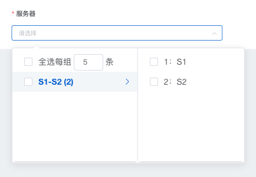

### &lt;<!-- name:start -->star-server<!-- name:end -->/&gt;

<!-- desc:start -->
服务器组件
<!-- desc:end -->


### 示例
```
<el-form-item label="服务器" required>
  <ServerRangeGroupCondition
      :param-object="mail_info"
      condition-key="server_id_list"
      width="100%"
      size="small"
  />
</el-form-item>
```

### Props
<!-- props:start -->
<!-- props:end -->

### Methods
<!-- methods:start -->
<!-- methods:end -->

### Events
<!-- events:start -->
<!-- events:end -->

### Slots
<!-- slots:start -->
|name|说明|
|------|------|
|default|--|
<!-- slots:end -->
