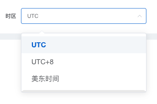

### &lt;<!-- name:start -->star-timezone<!-- name:end -->/&gt;

<!-- desc:start -->
时区组件
<!-- desc:end -->


### 示例
```
<TimeZoneMiddle
    :children-width="'100%'"
    :param-object="listQuery"
    condition-key="time_zone"
    label-width="68px"
></TimeZoneMiddle>
```

### Props
<!-- props:start -->
<!-- props:end -->


### Methods
<!-- methods:start -->
<!-- methods:end -->


### Events
<!-- events:start -->
<!-- events:end -->


### Slots
<!-- slots:start -->
|name|说明|
|------|------|
|default|--|
<!-- slots:end -->
