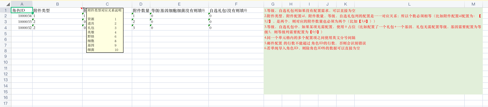
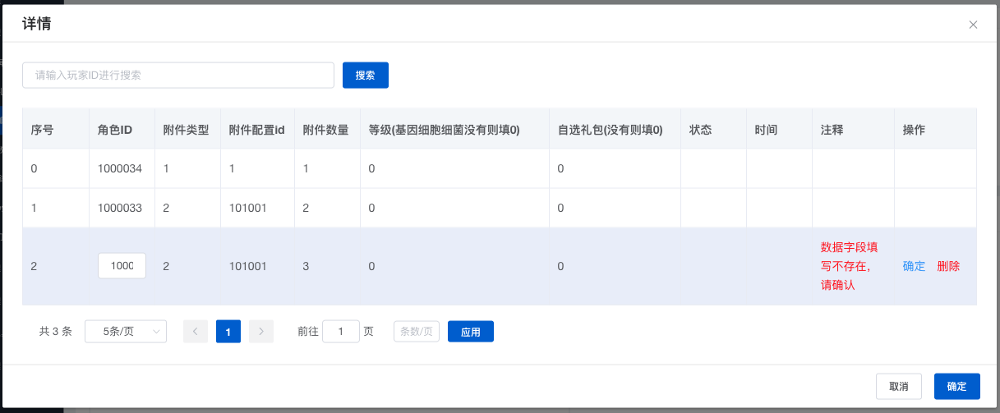

# 前端批量导入excel数据总结

以批量导入【玩家+附件数据.xlsx】文件为例：



1、读文件

```
<input type="file" accept=".xlsx, .xls" @change="onChangeFile" />
```

1.1、文件效验（文件格式、文件大小）

```
const files = e.target.files;

isExcel(file) {
  return /\.(xlsx|xls|csv)$/.test(file.name);
},

beforeUpload(file) {
  const isLt1M = file.size / 1024 / 1024 < 1;
  if (isLt1M) {
    return true;
  }
  this.$message({
    message: '当前最大支持上传1M内文件',
    type: 'warning',
  });
  return false;
},
```

2、解析文件（表头 header 、行数据 results） 

2.1 前端效验行数是否符合规范（例如：小于1000行）  
2.2 前端效验列数据格式是否正确（例如：附件数量只能是数字）  
2.3 后端检测行数据是否配置合法（例如：玩家ID是否存在）  

```
const reader = new FileReader();
reader.onload = (e) => {
  const result = e.target.result;
  const workbook = XLSX.read(result, { type: 'array' });
  const firstSheetName = workbook.SheetNames[0];
  const worksheet = workbook.Sheets[firstSheetName];
  const header = this.getHeaderRow(worksheet);
  const results = XLSX.utils.sheet_to_json(worksheet);
};
reader.readAsArrayBuffer(file);

getHeaderRow(sheet) {
  const headers = [];
  const range = XLSX.utils.decode_range(sheet['!ref']);
  let C;
  const R = range.s.r;
  /* start in the first row */
  for (C = range.s.c; C <= range.e.c; ++C) {
    /* walk every column in the range */
    const cell = sheet[XLSX.utils.encode_cell({ c: C, r: R })];
    /* find the cell in the first row */
    let hdr = 'UNKNOWN ' + C; // <-- replace with your desired default
    if (cell && cell.t) hdr = XLSX.utils.format_cell(cell);
    headers.push(hdr);
  }
  return headers;
},
```

3、展示文件详情



3.1 表单输入玩家ID进行搜索  
3.2 前端分页展示当前页+符合搜索条件的数据  

4、支持表格中对行数据修改


4.1 点击编辑，编辑行数据  
4.2 点击确定，修改行数据  
4.3 修改后调用服务端验证数据是否正确  
4.4 效验成功更新本地缓存的数据  

